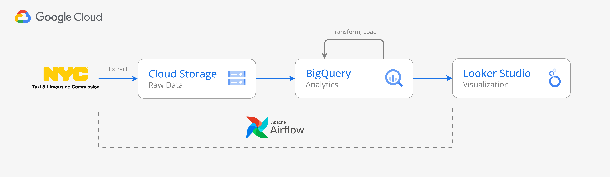

# NYC Taxi Data Processing ETL Pipeline on GCP

## Project Structure

## Overview
End-to-end data engineering pipeline that retrieves "Yellow Taxi Trip Records" data from Taxi & Limousine Commission by leveraging Google Cloud services. This pipeline orchestrates monthly data retrievals and ETL with Apache Airflow, and allows to analze with Looker Studio.

## Tools Used
- **Jupyter Notebook:** Utilized for initial data exploration, analysis, and establishing a baseline for data extraction.
- **Google Cloud Storage:** Used as a data lake to store raw data as parquet file.
- **Google BigQuery:** Storing and processing structured data for analytics.
- **Google Looker Studio:** Enabling visual representation and analysis of the data. 
- **Apache Airflow:** Scheduling and monitoring monthly data processing pipeline. 

## Getting Started
1. Clone this repository.
2. Review the Jupyter Notebooks in the `notebooks` directory for initial exploration and setup.
3. 
4. Install and launch Apache Airflow (local or Cloud Composer), and deploy the DAG in `dag` directory.
5. Configure the 

## License
This project is licensed under MIT License - see the [LICENSE](LICENSE) file for details.
